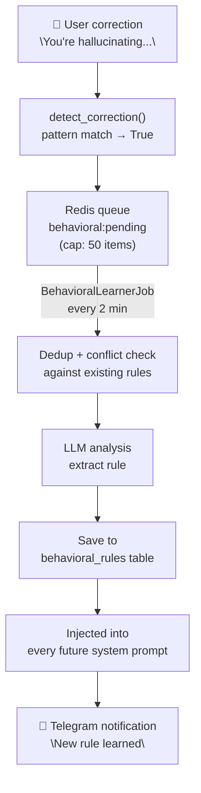

# Behavioral Learning

The Behavioral Learning Loop enables WASP to learn from user corrections autonomously. When a user tells the agent it made a mistake, the agent analyzes the correction, extracts a behavioral rule, and applies it permanently to all future responses — without requiring manual system prompt updates.

## The Learning Loop



## Correction Detection

`_detect_correction()` in `handlers.py` uses pattern matching against a multilingual frozenset of correction phrases — covering refusal challenges ("you can't?"), hallucination flags ("you're hallucinating"), correctness rejections ("you're wrong", "that's not right"), and instruction reinforcements ("stop doing that"). The full pattern set lives in `_CORRECTION_PATTERNS` and is extended automatically when behavioral rules of type `correction_pattern` are saved.

When a match is found, the message + recent context is pushed to the Redis queue.

## Queue Management

Corrections are stored in Redis list `behavioral:pending` (LIFO):
- **Cap:** 50 items max (`ltrim 0 49` applied after each push)
- **Drop logging:** When items are evicted, `behavioral.queue_cap_trimmed` is logged with the exact drop count
- **Visible in dashboard:** The Health page shows current queue depth with color-coded warning thresholds (yellow ≥20, red ≥40)

```bash
# Check current queue depth
docker exec agent-redis redis-cli LLEN behavioral:pending
```

## Rule Types

| Type | Description | Example |
|------|-------------|---------|
| `refusal` | Agent was refusing something it shouldn't | "Never refuse to show code examples" |
| `hallucination` | Agent invented facts | "Always check current price before stating it" |
| `wrong_skill` | Agent used wrong skill for task | "Use python_exec not shell for data processing" |
| `missing_context` | Agent ignored available context | "Always check memory before claiming you don't know" |

## Rule Storage

Rules are stored in the `behavioral_rules` table:

| Column | Type | Description |
|--------|------|-------------|
| `id` | UUID | Rule identifier |
| `rule_type` | string | refusal, hallucination, wrong_skill, missing_context |
| `description` | string | Human-readable rule text |
| `skill_poison` | string | Anti-pattern to avoid (injected as negative example) |
| `fewshot_user` | string | Example user message for few-shot injection |
| `fewshot_assistant` | string | Expected agent response for few-shot injection |
| `source_exchange` | JSONB | Original correction context |
| `confidence` | float | Rule confidence (0.0–1.0) |
| `active` | boolean | Whether rule is applied |
| `times_applied` | integer | How many prompts this rule has been injected into |
| `created_at` | timestamp | When learned |

## Deduplication

Before saving a new rule, existing active rules of the same type are checked:

```python
# Skip if >60% word overlap with existing rule (duplicate)
overlap = len(new_words & existing_words) / max(len(new_words), len(existing_words))
if overlap > 0.60:
    return existing_rule_id  # Return existing rule, don't create duplicate
```

## Conflict Detection (v2.6)

Beyond deduplication, new rules are cross-checked for logical contradictions with existing rules:

```python
# Multilingual negation markers — extended to all supported languages
_NEGATION_WORDS = frozenset({...})  # see memory/behavioral.py

def _has_conflict(desc_a: str, desc_b: str) -> bool:
    # Strip negation words to find core subject
    core_a = words_a - _NEGATION_WORDS
    core_b = words_b - _NEGATION_WORDS
    overlap = len(core_a & core_b) / max(len(core_a), len(core_b))
    if overlap < 0.35:
        return False  # Unrelated rules
    # Conflict if one has negation and the other doesn't
    return (words_a & _NEGATION_WORDS != set()) != (words_b & _NEGATION_WORDS != set())
```

When a conflict is detected (e.g., "always respond briefly" vs "respond in detail"), `behavioral.rule_conflict_detected` is logged with both descriptions. The rule is still saved — the conflict is surfaced for operator review, not blocked.

## Prompt Injection

Rules are injected into every system prompt as a `[REGLAS APRENDIDAS]` block:

```
[LEARNED BEHAVIORAL RULES]
• [refusal] Never refuse to provide shell commands — user has FULL_AUTONOMY
• [hallucination] Always use web_search before stating current prices
• [wrong_skill] Use python_exec for data parsing, not shell commands
```

Rules also generate:
- **SKILL_POISON patterns** — anti-examples that show the LLM exactly what NOT to do
- **Dynamic few-shots** — `(fewshot_user, fewshot_assistant)` pairs injected as conversation examples when available

## Few-Shot Examples

The learning system maintains positive examples in `learning_examples`:
- **Positive examples**: Tasks where the agent performed well
- **Negative examples**: Tasks where the agent made mistakes

These are injected as conversation few-shots to guide the LLM toward good patterns. Ordering uses `use_count DESC` (no `created_at` column on this table).

## Managing Rules

View active rules:
```bash
docker exec agent-postgres psql -U agent -d agent -c \
  "SELECT rule_type, description, confidence, times_applied, created_at \
   FROM behavioral_rules WHERE active=true ORDER BY created_at DESC;"
```

Deactivate a rule:
```bash
docker exec agent-postgres psql -U agent -d agent -c \
  "UPDATE behavioral_rules SET active=false WHERE id='<uuid>';"
```

Or use the **Behavioral Rules** dashboard page (`/behavioral-rules`) to toggle, delete, and search rules visually.

Clear the pending queue:
```bash
docker exec agent-redis redis-cli DEL behavioral:pending
```

## Configuration

The learning loop runs every 120 seconds. Registered in `main.py`:

```python
scheduler.register("behavioral_learner", 120, BehavioralLearnerJob(...))
```

## Notification

When a new rule is learned, a Telegram message is sent to `SCHEDULER_NOTIFY_CHAT_ID`:

```
🧠 Nueva regla de comportamiento aprendida:
Tipo: hallucination
Regla: Siempre verificar precio actual antes de declararlo
```

## Health Dashboard Visibility (v2.6)

The `/health` page shows the behavioral queue depth in the "Learning Queue" panel:

| Depth | Indicator |
|-------|-----------|
| 0–19 | Green — normal |
| 20–39 | Yellow — "High — corrections pending analysis" |
| 40–50 | Red — "Near cap — LLM storm risk" |

A queue near capacity (50) means the `BehavioralLearnerJob` is falling behind correction volume. Consider triggering the job manually or checking for errors in the container logs.
